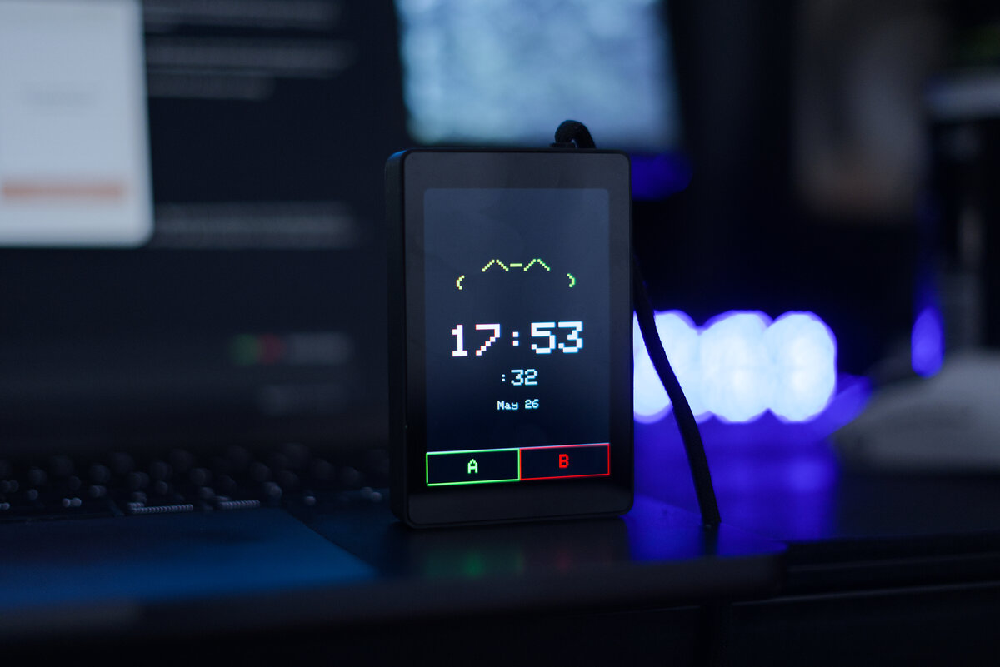

# claude-desktop-buddy — WT32-SC01 Plus port

A custom fork of Anthropic's
[`claude-desktop-buddy`](https://github.com/anthropics/claude-desktop-buddy),
ported to the WT32-SC01 Plus (ESP32-S3, 3.5" 480×320 ST7796, capacitive
touch). The BLE protocol, state machine, 18 ASCII pets, GIF characters, and
stats are **unchanged** from upstream. Only the hardware layer was swapped, so
physical buttons become on-screen touch buttons and the IMU-driven motion
features are dormant, as there's no IMU on this board.

This port was made for an [XDA article](https://www.xda-developers.com/tried-anthropic-open-source-desk-pet-esp32-fixes-annoying-thing/).

> **Building your own device?** You don't need any of the code here. See
> **[REFERENCE.md](REFERENCE.md)** for the wire protocol: Nordic UART
Service UUIDs, JSON schemas, and the folder push transport.

Claude for macOS and Windows can connect Claude Cowork and Claude Code to maker
devices over BLE, so developers and makers can build hardware that displays
permission prompts, recent messages, and other interactions. The upstream project built a desk pet on the M5StickC Plus that lives off permission approvals and
interaction with Claude. It sleeps when nothing's happening, wakes when sessions
start, gets visibly impatient when an approval prompt is waiting, and lets you
approve or deny right from the device. This fork runs that same buddy on the
bigger WT32-SC01 Plus touchscreen.

<p align="center">
  
</p>

## Hardware

This fork targets the WT32-SC01 Plus (ESP32-S3, 480×320 ST7796 8-bit
parallel display, capacitive touch, no IMU/buzzer). The original firmware has
`#include <M5StickCPlus.h>` everywhere; rather than editing every source
file, `src/compat/` comes with its own `M5StickCPlus.h` shim that is placed first
on the include path (`-Isrc/compat`), so all those includes transparently
resolve to the shim. The shim maps the `M5.*` API onto WT32-SC01 Plus hardware:

| `M5.*` the firmware uses | Backed on SC01 Plus by |
|---|---|
| `M5.Lcd` (`TFT_eSPI`) | TFT_eSPI |
| `TFT_eSprite` | TFT_eSPI |
| `M5.BtnA`/`M5.BtnB` | virtual buttons driven by on-screen touch zones |
| `M5.Axp` | backlight brightness (`analogWrite` on GPIO45) + faked USB power |
| `M5.Imu` | null values stub (no IMU) |
| `M5.Beep` | no buzzer |
| `M5.Rtc` | software RTC fed by the desktop's `{"time":[…]}` message |

No app logic, BLE, GIF/ASCII, or stats code was touched. The original
135×240 sprite is scaled 2x and pushed into the top of the 320×480 panel; the
freed strip at the bottom becomes two large touch targets that act as the
physical A/B buttons.

Because the scaled UI prints its own context hint directly above the bar, the
two targets are always labelled by whatever the screen says.

## Flashing

Install
[PlatformIO Core](https://docs.platformio.org/en/latest/core/installation/),
then:

```bash
pio run -t upload
pio run -t uploadfs
```

`uploadfs` auto-stages `characters/bufo` into `data/` via `tools/prep_fs.py`
(wired in as `extra_scripts`), so the filesystem image always pushes a character.
The original M5StickC build still lives under `-e m5stickc-plus`.

If you're starting from a previously-flashed device, wipe it first:

```bash
pio run -t erase && pio run -t upload
```

Once running, you can also wipe everything from the device itself: hold A
(long-press the left touch target) -> settings -> reset -> factory reset -> tap
twice.


## Pairing

To pair your device with Claude, first enable developer mode (**Help →
Troubleshooting → Enable Developer Mode**). Then, open the Hardware Buddy
window in **Developer → Open Hardware Buddy…**, click **Connect**, and pick
your device from the list (`Claude-XXXX`). macOS will prompt for Bluetooth
permission on first connect; grant it.

<p align="center">
  
  
</p>

Once paired, the bridge auto-reconnects whenever both sides are awake.

If discovery isn't finding the device:

- Make sure the screen is awake (tap it)
- Check the settings menu -> bluetooth is on

## Controls

On this board the two physical buttons are **on-screen touch zones** along the
bottom bar: **A** on the left, **B** on the right:

|                     | Normal               | Pet         | Info        | Approval    |
| ------------------- | -------------------- | ----------- | ----------- | ----------- |
| **A** (left zone)  | next screen          | next screen | next screen | **approve** |
| **B** (right zone)   | scroll transcript    | next page   | next page   | **deny**    |
| **Long-press A**    | menu                 | menu        | menu        | menu        |

Tap anywhere to wake the screen. The screen auto-powers-off after 30s of no
interaction (kept on while an approval prompt is up).

> **No IMU on this board**, so the shake-to-dizzy, face-down nap, and clock
> auto-rotate inputs are dormant. The `dizzy`/`heart`/nap *states* still trigger
> from BLE events; only the motion gestures are gone.

## ASCII pets

Eighteen pets, each with seven animations (sleep, idle, busy, attention,
celebrate, dizzy, heart). Menu → "next pet" cycles them with a counter.
Choice persists to NVS.

## GIF pets

If you want a custom GIF character instead of an ASCII buddy, drag a
character pack folder onto the drop target in the Hardware Buddy window. The
app streams it over BLE and the device switches to GIF mode live. **Settings
→ delete char** reverts to ASCII mode.

A character pack is a folder with `manifest.json` and 96px-wide GIFs:

```json
{
  "name": "bufo",
  "colors": {
    "body": "#6B8E23",
    "bg": "#000000",
    "text": "#FFFFFF",
    "textDim": "#808080",
    "ink": "#000000"
  },
  "states": {
    "sleep": "sleep.gif",
    "idle": ["idle_0.gif", "idle_1.gif", "idle_2.gif"],
    "busy": "busy.gif",
    "attention": "attention.gif",
    "celebrate": "celebrate.gif",
    "dizzy": "dizzy.gif",
    "heart": "heart.gif"
  }
}
```

State values can be a single filename or an array. Arrays rotate: each
loop-end advances to the next GIF, useful for an idle activity carousel so
the home screen doesn't loop one clip forever.

GIFs are 96px wide (matching the original sprite) and are scaled up
with the rest of the UI. Crop tight to the character — transparent margins
waste screen and shrink the sprite. `tools/prep_character.py` handles the
resize: feed it source GIFs at any sizes and it produces a 96px-wide set where
the character is the same scale in every state.

The whole folder must fit under 1.8MB —
`gifsicle --lossy=80 -O3 --colors 64` typically cuts 40–60%.

See `characters/bufo/` for a working example.

If you're iterating on a character and would rather skip the BLE round-trip,
`tools/flash_character.py characters/bufo` stages it into `data/` and runs
`pio run -t uploadfs` directly over USB.

## The seven states

| State       | Trigger                     | Feel                        |
| ----------- | --------------------------- | --------------------------- |
| `sleep`     | bridge not connected        | eyes closed, slow breathing |
| `idle`      | connected, nothing urgent   | blinking, looking around    |
| `busy`      | sessions actively running   | sweating, working           |
| `attention` | approval pending            | alert, **LED blinks**       |
| `celebrate` | level up (every 50K tokens) | confetti, bouncing          |
| `dizzy`     | BLE dizzy event             | spiral eyes, wobbling       |
| `heart`     | approved in under 5s        | floating hearts             |

## Project layout

```
src/
  main.cpp       — loop, state machine, UI screens
  buddy.cpp      — ASCII species dispatch + render helpers
  buddies/       — one file per species, seven anim functions each
  ble_bridge.cpp — Nordic UART service, line-buffered TX/RX
  character.cpp  — GIF decode + render
  data.h         — wire protocol, JSON parse
  xfer.h         — folder push receiver
  stats.h        — NVS-backed stats, settings, owner, species choice
  compat/        — WT32-SC01 Plus shim (M5StickCPlus.h shim, touch, RTC,
                   backlight, scaled sprite push, soft buttons, board pins)
characters/      — example GIF character packs
tools/           — generators and converters
```

## Known limitations

- **Power telemetry is faked**: There's no battery gauge on this board, so the
  shim reports USB power with no current/battery readings.
- **No buzzer**: `M5.Beep` does nothing.
- **No IMU**: shake, face-down nap, and clock auto-rotate
  gestures are dormant; the corresponding states still fire from BLE events.

## Availability

The BLE API is only available when the desktop apps are in developer mode
(**Help → Troubleshooting → Enable Developer Mode**). It's intended for
makers and developers and isn't an officially supported product feature.
